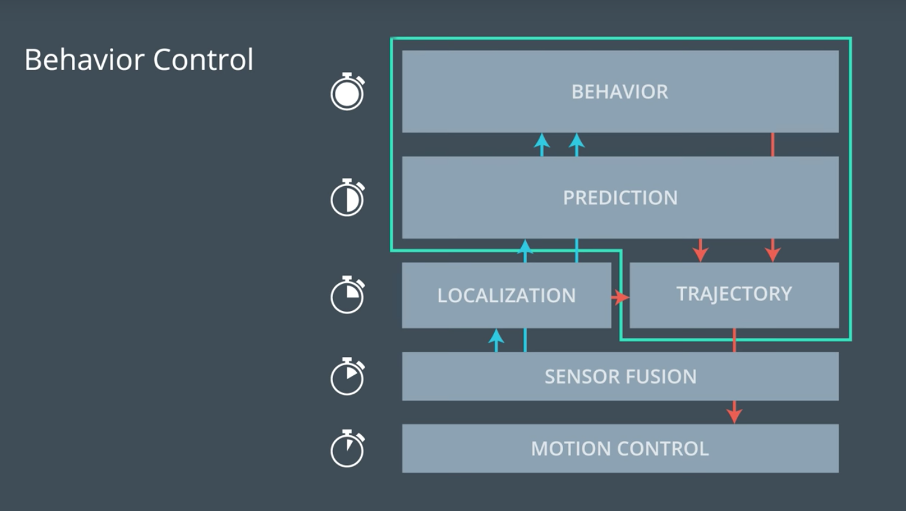
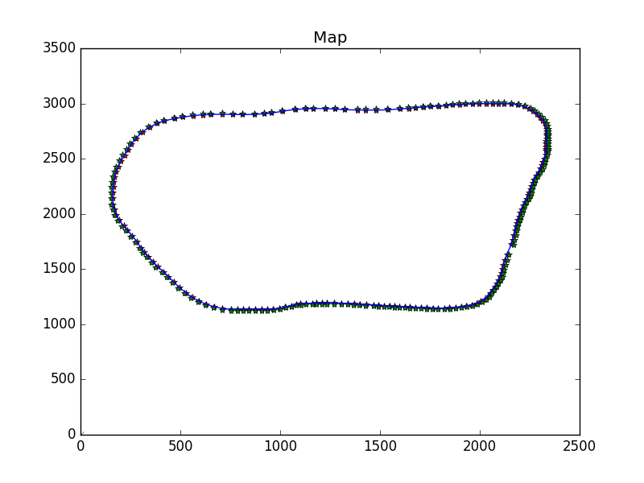
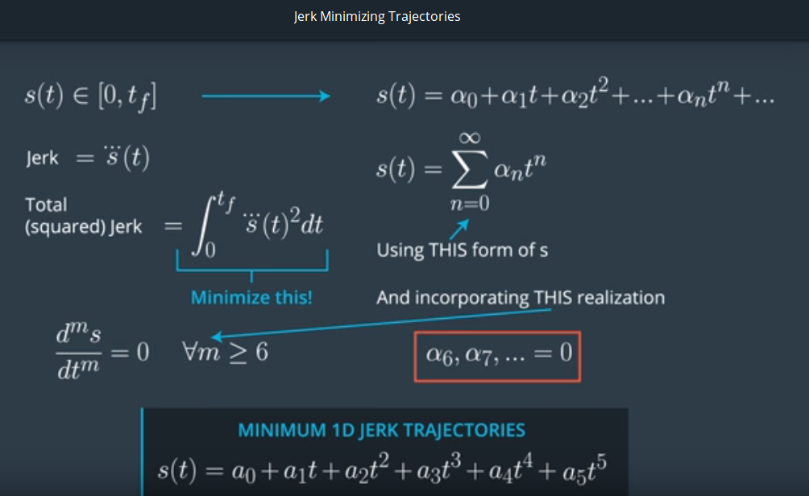
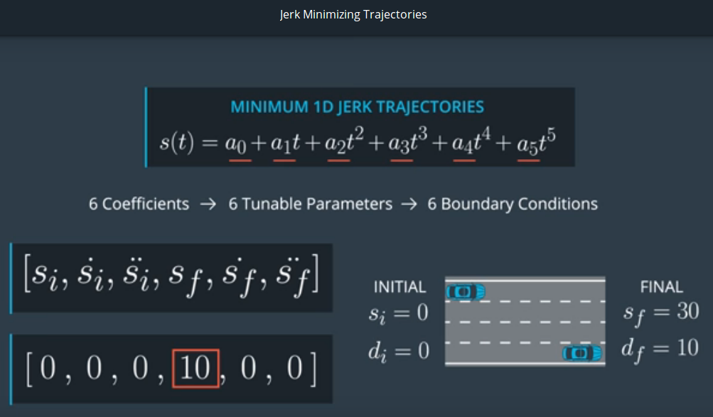
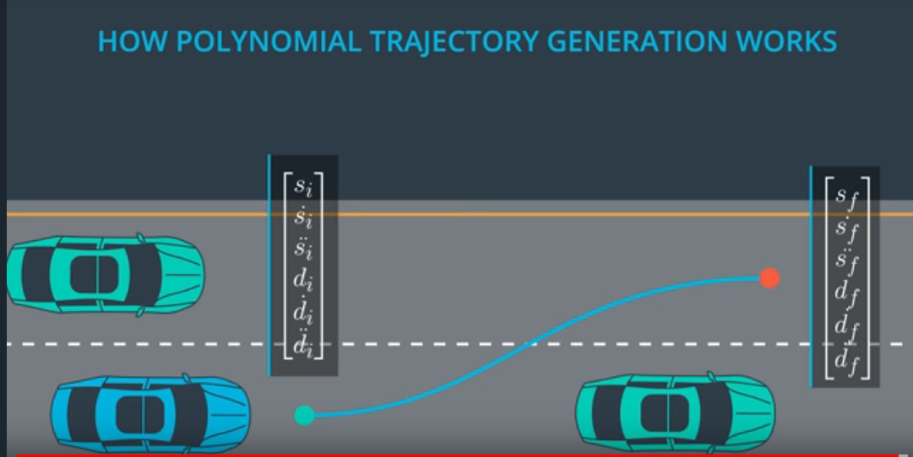
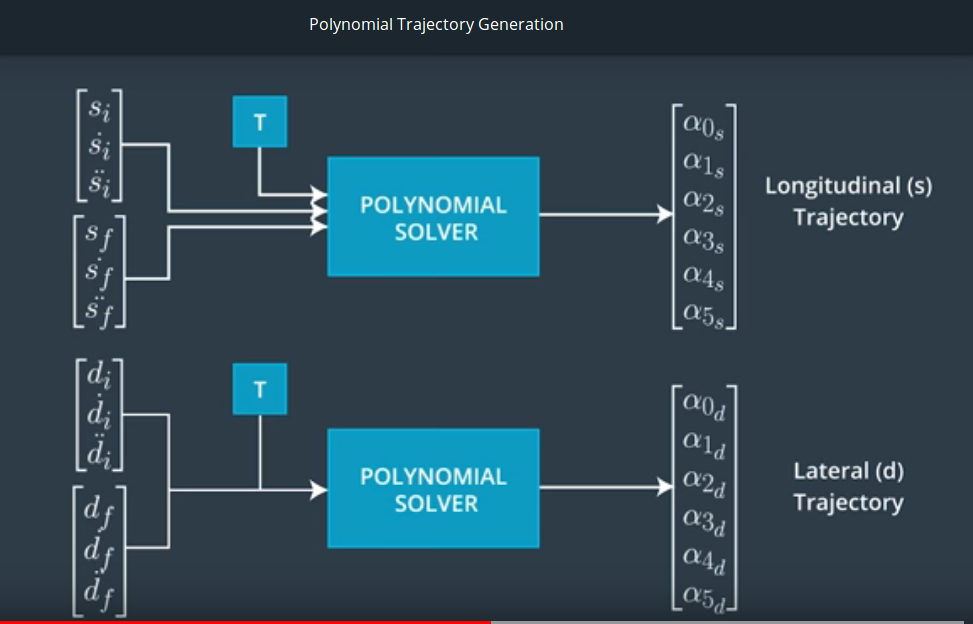
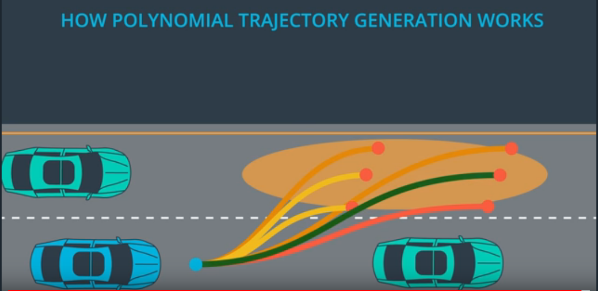

# CarND-Path-Planning-Project
Self-Driving Car Engineer Nanodegree Program  
Simulator and track used by default: https://github.com/udacity/Bosch-Challenge/releases/tag/v2.0  
(cf params.cpp to use different tracks with the same Unity3D based simulator)  

Coding rules:  
* https://github.com/Microsoft/AirSim/blob/master/docs/coding_guidelines.md  
* https://google.github.io/styleguide/cppguide.html  
  
Latest additions:  
* Safety Distances:   
   https://www.engadget.com/2017/10/17/intel-mobileye-autonomous-vehicle-safety/  
   https://arxiv.org/pdf/1708.06374.pdf  
   Current lane + lane changes  
  
* Trajectory generation: emergency trajectory in Frenet  
  Generate trajectory point by point (with max accel/decel) in Frenet coordinates  

* Collision detections:  
  Use SAT (Separating Axis Theorem) method cf http://www.dyn4j.org/2010/01/sat/


[//]: # (Image References)
[image1]: ./img/behavior.png
[image2]: ./img/driving.png
[image3]: ./img/jmt.png
[image4]: ./img/jmt_conditions.png
[image5]: ./img/jmt_conditions_bis.png
[image6]: ./img/jmt_solver.png
[image7]: ./img/overview.png
[image8]: ./img/predictions.png
[image9]: ./img/track.png
[image9]: ./img/trajectories.png

## Project description

<p align="center">
     
     <br>driving.png
</p>

### Overview  


In an Autonomous Driving pipeline we deal sequentially with the following modules:
* **perception:** sensors in charge of detecting objects
* **fusion:** sensor fusion providing a consolidated view of detected objects
* **localization (optionally):** 
* **path planning:** in charge of planning the vehicle trajectory up to a specific goal
* **command and control:** taking as inputs the planned path it will control the actuators of the vehicle 

The path planning module is using as inputs:
* the sensor fusion outputs
* the map and localization 
  
It then provides as output a set of waypoints to follow.  

The Path Planning module is typically decomposed into the following set of sub-modules:
* **predictions:** will predict the trajectories of the surrounding detected objects
* **behavior planner:** will define a set of candidate high-level targets for the vehicle to follow (lane changes, slow down ...)
* **trajectories generation:** for every possible high level target, a precise path to follow will be computed  
* **trajectories cost ranking:** for each trajectory, a cost will be derived (depending on feasibility, safety, legality, comfort, and efficiency) and the trajectory with the lowest cost will be chosen  

The driving policy is typically defined by these cost functions. It can be tuned to have a very conservative driving experience (which is the case in the below implementation: keep a rather big safety distance with the vehicule in front of you, do lane changes only when there is lots of free space on the target lane...) or it can be tuned to target a more speedy driving experience (making lots of lane changes as soon as possible to drive as fast as possible...)

In the below implementation, the behavior planner is not implemented as a Finite States Machine and is not taking a decision right away like lane change or not but it rather defines several possible targets. It will be up to the cost function to choose the best decision based on its applicability: i.e. based on a cost function evaluation of the generated trajectories.  

The main reference for the below implementation is the following paper:  
**"Optimal Trajectory Generation for Dynamic Street Scenarios in a Frenet Frame" from Moritz Werling and all** https://pdfs.semanticscholar.org/0e4c/282471fda509e8ec3edd555e32759fedf4d7.pdf   


<p align="center">
     
     <br>overview.png
</p>

In the code excerpt below we do the following:
* **generate predictions:** based on sensor fusion information, we locate for every lane the closest car in front and behind the ego vehicle. This provides a sort of basic scene detection or summary. For these objects, we extrapolate the trajectories up to a specific horizon (typically 1 second)  
* **the behavior planner defines candidate targets**: a set of candidate {target_lane, target_speed, target_time for maneuver }
* **for every candidate targets a trajectory is computed**
* **for every candidate trajectories a cost is computed**
* **the trajectory with the lowest cost is chosen**  
  

```cpp
     // --------------------------------------------------------------------------
     // --- 6 car predictions x 50 points x 2 coord (x,y): 6 objects predicted over 1 second horizon ---
     Predictions predictions = Predictions(sensor_fusion, car, PARAM_NB_POINTS /* 50 */);

     Behavior behavior = Behavior(sensor_fusion, car);
     vector<Target> targets = behavior.get_targets();
     
     Trajectory trajectory = Trajectory(targets, map, car, previous_path, predictions);
```

```cpp
Trajectory::Trajectory(vector<Target> targets, Map &map, CarData &car, PreviousPath &previous_path, Predictions &predictions) {
  for (size_t i = 0; i < targets.size(); i++) {
    TrajectoryXY trajectory;
    if (PARAM_TRAJECTORY_JMT) {
      TrajectoryJMT traj_jmt;
  
      // generate JMT trajectory in s and d: converted then to (x,y) for trajectory output
      traj_jmt = generate_trajectory_jmt(targets[i], map, previous_path);
      trajectory = traj_jmt.trajectory;
      trajectories_sd_.push_back(traj_jmt.path_sd);
    } else {
      // generate SPLINE trajectory in x and y
      trajectory = generate_trajectory(targets[i], map, car, previous_path);
    }
  
    Cost cost = Cost(trajectory, targets[i], predictions, car.lane);
    costs_.push_back(cost);
    trajectories_.push_back(trajectory);
  }
  
  // --- retrieve the lowest cost trajectory ---
  min_cost_ = INF;
  min_cost_index_ = 0;
  for (size_t i = 0; i < costs_.size(); i++) {
    if (costs_[i].get_cost() < min_cost_) {
      min_cost_ = costs_[i].get_cost();
      min_cost_index_ = i;
    }
  }
}
```

### Coordinate transforms

cf map.cpp  

Most of the work and reflection is done in the Frenet space where the longitudinal s(t) and lateral d(t) trajectories of the vehicle are tracked with respect to a reference curve which is provided by a map (or a reference curve; e.g. middle of the road; provided at runtime in case there would be no map-based localization module).

The reference curve is depicted below: it is the center line of a circular track of close to 7 kilometers. The s and d information enable to locate a point relative to this reference curve.  
  
In terms of thinking, lane change or not, forward progress of the vehicle, ... it is much more convenient to think in terms of Frenet (s, d) coordinates rather than in Cartesian (x, y) coordinates.  
  
So a key point in the implementation is being able to do accurate (x, y) -> (s, d) -> (x, y) transformations.   
It is even more important if you plan to generate trajectories in the Frenet space as described in the paper from Moritz Werling.  
Unfortunately, the starter code provided initially for these conversions was not accurate enough to generate trajectories in the Frenet space: checking by converting back and forth to (x, y) coordinates, we get sometimes errors bigger than 10 meters. So I spent some time to improve these coordinate transforms.  

<p align="center">
     
     <br>track.png
</p>

The main changes done are the following:
* improved accuracy of the map itself: the track is described basically by 1 point and its associated normal vector every 30 meters. So we have 181 points for a close to 7 km circuit. Splines are now used to interpolate the track in between these points and create a new discrete map with 1 point every meter. Which is providing a much better accuracy when doing getFrenet (x, y) -> (s, d) conversions
* improved getXY accuracy: again splines (as pointed in Udacity forums) come to the rescue here.  
We are provided with x(t), s(t) and compute a x(s) spline.  
We are provided with y(t), s(t) and compute a y(s) slpine.    
We are provided with dx(t), s(t) and compute a dx(s) spline.  
We are provided with dy(t), s(t) and compute a dy(s) slpine.  
dx and dy rekate to x and y component of the normal vector (misleading names ...)  
From there doing a (s, d) -> (x, y) conversion is very simple: cf code below.   

```cpp
vector<double> Map::getXYspline(double s, double d)
{
     s = fmod(s, max_s);
     double x = spline_x(s) + d * spline_dx(s);
     double y = spline_y(s) + d * spline_dy(s);

     return {x,y};
}
```

Two fixes were done in the NextWaypoint code which had some issues at s wraparound:  
https://waffle.io/udacity/sdc-issue-reports/cards/59e8ee756ff7e100813ad856  

While driving a full track it can be checked now that the conversions error (x, y) -> (s, d) -> (x, y) are now on average around 0.6 meters (with a peak at 1.2 meters) which is well below the initial more than 10 meters error. I think this is probably the main reason why most of Udacity students reported issues while trying to work with JMT (s, d) frenet trajectories generations and finally went back to generate spline X, Y trajectories: where the dependency on the conversion functions is much lower.  

As a final note, I am wondering if the accuracy of the conversions could be further improved, but the fact that the map is  provided as a discrete set of 30 meters spaced points may prevent us for getting a perfect accuracy when doing frenet <-> cartesian conversions.    

### Predictions

cf prediction.cpp  

First we look for the closest objects: the car just in front of the ego vehicle and the car just behind the ego vehicle for every lane; assuming a Field Of View of 70 meters, front and back (which is a configurable parameter). So this provides a sort of scene summary with at most 6 surrounding cars: as we are dealing with 3 lanes here.  
Thanks to the sensor fusion information, a speed estimate is provided and used to compute the future positions of these (at most) 6 objects up to an horizon of typically 1 second.  

These predictions will be used later on to check for potential collisions and safety distances and evaluate whether a lane is a good target or not e.g. depending on the presence and/or speed of cars in these lanes.  
  
 So we use here a pure model based approach for the predictions. This could be improved and should be improved later on especially when dealing with more complex environments like city traffic or crossing roads: as depicted in the picture below different potential tracks for every surrounding object could be estimated and associated with probabilities that would evolve as we get more evidences related to a specific maneuver. And here typically machine learning and deep learning techniques could be used: which can lead to using a combined data driven and model based approach to generate predictions and associated probabilities.  

<p align="center">
     
     <br>predictions.png
</p>

### Behavior planner

cf behavior.cpp  

In this implementation the behavior planner will provide a list of candidate targets rather than a single suggested maneuver.
The first possible target will relate to adjusting the speed in our lane and keeping basically a rather big 30 meters distance with the vehicule in front of us; we end up driving at the same speed, 30 meters behind the vehicule in front of us.  

Then other targets are proposed: for every other adjacent lane. Then for every lane target, the behavior planner proposes a speed target corresponding to either our current lane speed target or a slower speed.  

So this typically provide a set of at most 9 targets, assuming you are in the midlle lane with 3 speed targets (max acceleration, constant speed, max deceleration) per lane.  

Later on a trajectory for every possible target wil be computed and they will be ranked against some cost functions to choose the best option.  

<p align="center">
     
     <br>behavior.png
</p>


### Trajectories generation

cf trajectory.cpp  

The trajectories can be generated in 2 different ways:
* in (x, y) coordinates by using spline functions.
* in (s, d) coordinates by using the Jerk Minimizing Trajectory approach described in the paper from Moritz Werling.

The first method is the one proposed in the walk through video of the project where s and d coordinates are used only to define the final target eg a s of 30 meters away with a d corresponding to the target lane. But then, this target point is converted into (x, y) coordinates and a trajectory going from the start point up to the end point (in cartesian coordinates) is computed by using splines. Using splines ensures that continuity is preserved for the generated trajectory and its 1st and 2nd derivatives: so we guarantee continuity in terms of trajectory, speed and acceleration including end points and previous trajectory. The advantage of this method is that it works pretty well even if the (s, d) estimates are not that accurate as it mainly works in (x, y) coordinates and most of the maths is handled via the C++ spline library which is very simple to use. In terms of drawbacks, it does not guarantee Minimum Jerk which is related to maximum comfort for the user.  

So that is why in the lectures from Udacity & Daimler Benz of the Self Driving Car Nanodegree, an approach based on Jerk Minimization Trajectory is presented. This approach is described in details in the paper from Moritz Werling and has been implemented here. It is the 2nd method: JMT trajectory generation in (s, d) coordinates.  
  
 The starting point consists in trying to find a trajectory that has minimum jerk i.e. maximum comfort for the user. 
 
 The jerk corresponds to variations in acceleration. So we are looking at the 3rd derivatives and we want to minimize the sum of these 3rd derivatives from t_start to t_end. As demonstrated in the folowing link http://www.shadmehrlab.org/book/minimum_jerk/minimumjerk.htm, **a Jerk Minimizing Trajectory has to be a quintic polynomial**.  
   
 So we end up looking for:
 * a quintic polynomial for the longitudinal part: s(t) is a polynom of order 5
 * a quintic polynomial for the lateral part: d(t) is a polynom of order 5
  
Note that at high speed, s(t) and d(t) can be computed independently and then converted back to (x, y) coordinates whereas at low speed s(t) and d(t) can not be computed independently (cf the paper from Moritz Werling for more details on this topic). That is why in the code there is a special case at low speed, where we vary only s(t) and keep d(t) constant. Nevertheless we can observe that our cold start, with JMT trajectory generation is not that good: we have useless wheels movements. It is typically a subject for further improvement (even if it does not violate any speed, acceleration and jerk criteria). But then after the cold start, everything is good and running smoothly.   

<p align="center">
     
     <br>jmt.png
</p>


So the problem is now to find these s(t) and d(t) quintic polynomials.  We are left with 6 unknown coefficients and hence we need 6 equations to solve this problem. By using start conditions and end conditions applied to the function and its 1st and 2nd derivaties we will define 6 equations and so we will be able to solve for the unknown coefficients.

<p align="center">
     
     <br>jmt_conditions.png
</p>

<p align="center">
     
     <br>jmt_conditions_bis.png
</p>

The critical point now is to properly define the start and end conditions.  

For the start conditions, there is no other choice than using a point from the previous generated trajectory. To ensure continuity for the position, speed and acceleration, the point has to be placed somewhere on the previous generated trajectory where the position has not yet been reached in practice by the vehicle. In the implementation below we are typicaly using the 8th point (so 8 * 20 ms) in the previous 50 points (1 second) generated trajectory. This is a tradeoff here to account for:
* simulator latency on one side. When we send a trajectory to the simulator and get an answer back, usually 3 points have been consumed. Then we compute a new trajectory; send it to the simulator. But while we compute a new trajectory, the simulator is still consuming points from the previous trajectory. So the 8th point here is to make sure that we start a new trajectory from a point that has not yet been consumed (applied in practice by the simulator or our vehicle).
* take into account new sensor fusion information to adapt (re compute) ASAP the trajectory. As soon as we have new sensor fusion information, we would like to re evaluate our trajectory. So idealy every point, every 20 ms here.  

Now you may be wondering why are we then evaluating a trajectory for 50 points if we only use 8 points and then recompute a new trajectory ? This is for collision avoidance checks. We generate the trajectory over a 1 second horizon to check for potential future collisions.  
  
After defining the start conditions we have to define proper end conditions.  
  
For the lateral d(t) trajectory it is pretty simple. We define as end conditions:
* df: a d corresponding to the center of the target lane
* df_dot and df_ddot are set to zero: no variations at the end of our maneuver for the lateral movement.

For the longitudinal s(t) trajectory we define as end conditions:
* sf_ddot = 0: no acceleration
* sf_dot: final speed corresponding to our target speed
* sf = si + sf_dot * T: where T is set to 2 seconds. We do not want to spend too much time while doing the maneuver.
  
Note that in theory there is a conversion to do from cartesian speed to longitudinal speed: that is why a getSpeedToFrenet function is provided for the conversion. But in practice for now on (in the real code, not the excerpt below), I am using a simple hard coded heuristic to do the conversion with some safety margin. Typically sf_dot is set to 98% of the target cartesian speed. This is a point left for further investigation and improvement. The conversion ratio between cartesian speed and frenet s speed should take into account the curvature and d distance (how far away we are from the reference curve).    


```cpp
  double T = target_time; // 2 seconds if car_d center of line

  // si si_dot si_ddot: to be retieved
  double si = prev_path_s[last_point][0];
  double si_dot = prev_path_s[last_point][1];
  double si_ddot = prev_path_s[last_point][2];

  double di = prev_path_d[last_point][0];
  double di_dot = prev_path_d[last_point][1];
  double di_ddot = prev_path_d[last_point][2];

  double sf, sf_dot, sf_ddot;
  double df, df_dot, df_ddot;

  if (target_vel <= 10) // mph
  {
    // special handling at low speed: cf werling paper
    df = di;
    df_dot = 0;
    df_ddot = 0;

    sf_ddot = 0;
    sf_dot = mph_to_ms(target_vel);
    sf = si + 2 * sf_dot * T;
  }
  else
  {
    df = get_dcenter(target_lane);
    df_dot = 0;
    df_ddot = 0;

    sf_ddot = 0;
    sf_dot = mph_to_ms(target_vel);
    sf = si + sf_dot * T;
  }

  vector<double> start_s = { si, si_dot, si_ddot};
  vector<double> end_s = { sf, sf_dot, 0};

  vector<double> start_d = { di, di_dot, di_ddot };
  vector<double> end_d = { df, df_dot, df_ddot};
```

So now the problem is well defined. We have:
* a target Jerk Minimizing Trajectory that is a quintic polynomial (for s(t) and d(t))
* 6 unknown coefficients
* 6 equations defined via the definition of start and end conditions
* T: the time duration of the trajectory properly defined. So the trajectory starts at t_start=0 and the endpoint is at t_end=T

From now on, we just have to solve the equations i.e. do a matrix inversion to derive our 6 unknown coefficients. This is done in the **JMT** polynomial solver described below: diagram and code.  


<p align="center">
     
     <br>jmt_conditions.png
</p>

```cpp
vector<double> JMT(vector< double> start, vector <double> end, double T)
{
    /*
    Calculate the Jerk Minimizing Trajectory that connects the initial state
    to the final state in time T.

    INPUTS
    start - the vehicles start location given as a length three array
            corresponding to initial values of [s, s_dot, s_double_dot]
    end   - the desired end state for vehicle. Like "start" this is a
            length three array.
    T     - The duration, in seconds, over which this maneuver should occur.

    OUTPUT 
    an array of length 6, each value corresponding to a coefficent in the polynomial 
    s(t) = a_0 + a_1 * t + a_2 * t**2 + a_3 * t**3 + a_4 * t**4 + a_5 * t**5
    */

    MatrixXd A(3,3);
    VectorXd b(3);
    VectorXd x(3);

    A <<   pow(T,3),    pow(T,4),    pow(T,5),
         3*pow(T,2),  4*pow(T,3),  5*pow(T,4),
                6*T, 12*pow(T,2), 20*pow(T,3);

    b << end[0] - (start[0] + start[1]*T + 0.5*start[2]*T*T), 
         end[1] - (start[1] + start[2]*T), 
         end[2] - start[2];

    x = A.inverse() * b;

    return {start[0], start[1], start[2]/2, x[0], x[1], x[2]};
}
```

  
Once the s(t) and d(t) have been found for the trajectory, we convert back to (x, y) coordinates using the accurate getXYspline function: we want to check speeed and acceleration in cartesian coordinates.  
Also we have predictions from sensor fusion informations that are in (x, y) coordinates: so ultimately we check collision avoidance and safety distances in (x, y) coordinates.  

### Trajectories cost ranking

cf cost.cp  

Trajectories are ranked against a cost function. The cost function is decomposed into several sub-cost functions.  
By decreasing order of importance, corresponding to decreasing cost weights, we can list:
* feasibility cost: with respect to collision avoidance and vehicule capabilities ...
* safety cost: perfering to keep some buffer distance, good visibility ...
* legality cost: complying to speed limits ...
* comfort cost: minimizing jerk ...
* efficiency cost: with respect to speed and time to goal ...


In the current implementation we are taking into account:
* collision avoidance and safety distances: by checking the minimum distance between the predictions and the trajectory over a 1 second time horizon
* capabilities cost: a function is provided to check for max velocity, acceleration and jerk associated to every candidate trajectory.
* efficiency cost: we perfer higher target speeds (it is a short term speed)
* lane cost: we usually prefer staying in our lane (assuming other costs are equal) so we over penalize adjacent lanes when they are occupied (penality is based on distance wrt ego vehicule). And we give priority to "free lanes" without vehicle in Field Of View.

**So it is a rather conservative driving policy, doing lane changes only when there is lots of free space in the target lane.**  

**As a further evolution, a long term speed should be associated to every lane based on the speed of the vehicule in front of us (per lane) and we should try to drive into the lane with the best long term speed capability.**  

As a summary, with the current implementation we end up ranking up to 9 candidate trajectories and choose the one that best match our driving policy defined via a set of weighted cost functions.  


<p align="center">
     
     <br>trajectories.png
</p>

```cpp
double cost_function(vector<vector<double>> &trajectory, int target_lane, double target_vel, std::map<int, vector<vector<double>>> &predictions, vector<vector<double>> &sensor_fusion, int car_lane)
{
  double cost = 0; // lower cost preferred

  double cost_feasibility = 0; // vs collisions, vs vehicle capabilities
  double cost_safety = 0; // vs buffer distance, vs visibility
  double cost_legality = 0; // vs speed limits
  double cost_comfort = 0; // vs jerk
  double cost_efficiency = 0; // vs desired lane and time to goal

  double weight_feasibility = 100000; // vs collisions, vs vehicle capabilities
  double weight_safety      = 10000; // vs buffer distance, vs visibility or curvature
  double weight_legality    = 1000; // vs speed limits
  double weight_comfort     = 100; // vs jerk
  double weight_efficiency  = 10; // vs target lane, target speed and time to goal

  // 1) FEASIBILITY cost
  if (check_collision(trajectory, predictions)) cost_feasibility += 10;
  if (check_max_capabilities(trajectory)) cost_feasibility += 1;
  cost = cost + weight_feasibility * cost_feasibility;

  // 2) SAFETY cost
  double dmin = get_predicted_dmin(trajectory, predictions);
  if (dmin < param_dist_safety) cost_safety = param_dist_safety - dmin;
  cost = cost + weight_safety * cost_safety;
   
   ...

  return cost;
}
```

### Configurable parameters

cf params.h and params.cpp  

The configurable parameters are:

* map: different maps or tracks can be used if needed.
* const int param_nb_points = 50; // the trajectory is generated over 50 points (so 1 second typically)
* const double param_dt = 0.02; // 1 point every 0.02 s
* const double param_lane_width = 4.0; // meters
  
* const double param_max_speed = 22; // m.s-1
* const double param_max_accel = 10; // m.s-2
* const double param_max_jerk  = 10; // m.s-3 average jerk over 1 second

* const double param_fov = 70.0; // Field Of View

* const double param_max_speed_inc = param_max_accel * param_dt; // m.s-1 per 0.02 sec

* const double param_dist_slow_down = 30; // when a car is 30 m ahead of us => adjust speed to this car
* const double param_dist_safety = 3.5; // meters
* const double param_dist_collision = 2.75; // meters
  
// reduce latency reaction, but account for simulator latency ...  
// usualy 3 points consumed by simulator + 5 points margin (the simulator is still consuming new points)  
// => usually we are regenerating a new trajectory every 8 points (i.e. every 160 ms)  
  
// it is the number of points kept in previous_path_x and previous_path_y. All other points will be re computed  
* const int param_truncated_prev_size = 5; 

// we can generate trajectories by using 2 different methods
* const bool param_trajectory_jmt = true;

### Conclusion and next steps
  
That was a lot of work ...  
  
I would like to thank Udacity and their partners, mainly here in the context of Path Planning, the people from Mercedes-Benz for setting up high quality class courses on Autonomous Driving. I would like also to thank Aaron Brown from Udacity for providing this cool Unity based simulator and testing environment, David Silver from Udacity for creating this NanoDegree, the people on the Udacity forums and on the Udacity slack channels for providing valuable information and ideas.  

I have spent a lot of time on this project, learnt a lot and I am pretty happy with the result but there is nevertheless still much more work left to do...  
  
 Thinking about some possible next steps and topics for further improvement, I would list:  
 * driving policy (via cost functions) that targets maximal speed: to be tested on Bosch challenge tracks as well. This should be fun to do.
 * MPC (Model Predictive Control) integration: so we have path planning and control command tested together. The combined testing of path planning and command and control is very important.
 * emergency braking or emergency collision avoidances: in some cases other vehicules randomly merge into our lane even when we are dangerously close. So we have remaining potential collisions; even if they are quite rare. But quite rare is too much when dealing with cars... So we should further check if and how we could improve our collision avoidance scheme in emergency situations.  
 * better predictions: the trajectory predictions of other vehicles is really key to the path planning module. Some good ideas are presented in a paper listed in below references: Vehicle Trajectory Prediction based on Motion Model and Maneuver Recognition. The use of machine learning and deep learning techniques could be investigated also here to further improve predictions accuracy. 
 * by default here in this setup the simulated sensor fusion outputs are fully accurate: we could generate some noise and check how robust we still are
 * When the simulator reports an issue we should assert the software under test: for easier analysis of the problem.
 * How to speed up simulation ? Trying to further tune the system is time consuming right now as the simulation is not potentially "accelerated"
 * Currently a new trajectory is generated every 3 + 5 points: so we are dealing with a latency of 160 ms in terms of how fast we can react to a new sensor fusion output. This is not by Path Planning module design but related to the test and simulation environment. 
 * Some code clean up should be done: properly define additional classes ... add more comments ...
 * The code efficiency has to be checked (a proper profiling should be done) especially if we want to increase the number of potential targets in the future
 * JMT trajectory generation: 2 points are left for further improvement (low speed cases, cf paper from Moritz Werling) + curvature impact when dealing with speed 

### References:  

**Directly related to this project and implementation:**  
Optimal Trajectory Generation for Dynamic Street Scenarios in a Frenet Frame https://pdfs.semanticscholar.org/0e4c/282471fda509e8ec3edd555e32759fedf4d7.pdf   
Sampling Based Motion Planning for Heavy Duty Autonomous Vehicles http://liu.diva-portal.org/smash/get/diva2:1049189/FULLTEXT01.pdf  
Towards Fully Autonomous Driving: Systems and Algorithms https://www.cs.cmu.edu/~zkolter/pubs/levinson-iv2011.pdf  
Jerk Minimization Trajectory http://www.shadmehrlab.org/book/minimum_jerk/minimumjerk.htm http://mplab.ucsd.edu/tutorials/minimumJerk.pdf  
Path Planning for Highly Automated Vehicles http://publications.lib.chalmers.se/records/fulltext/182538/182538.pdf  
 
**For further investigation:**  
Vehicle Trajectory Prediction based on Motion Model and Maneuver Recognition https://hal.inria.fr/hal-00881100/PDF/IROS13_PIN_161867_.pdf  
Dynamic Speed Adaptation for Path Tracking Based on Curvature Information and Speed Limits https://www.ncbi.nlm.nih.gov/pmc/articles/PMC5492420/   
The formula for curvature https://www.ima.umn.edu/~miller/1372curvature.pdf  
Interaction aware trajectory planning for merge scenarios in congested traffic situations http://ieeexplore.ieee.org/document/7795596/  

**Some maths:**   
Introduction a l'optimisation (cours d'agrégation https://www.ljll.math.upmc.fr/privat/documents/optimAgreg.pdf   
Les multiplicateurs de Lagrange expliqués aux lycéens http://www.math.ens.fr/~budzinski/polys/Alg%C3%A8bre/Avanc%C3%A9/2011_ineg_cours.pdf  


## Simulator.
You can download the Term3 Simulator which contains the Path Planning Project from the [releases tab (https://github.com/udacity/self-driving-car-sim/releases).

### Goals
In this project your goal is to safely navigate around a virtual highway with other traffic that is driving +-10 MPH of the 50 MPH speed limit. You will be provided the car's localization and sensor fusion data, there is also a sparse map list of waypoints around the highway. The car should try to go as close as possible to the 50 MPH speed limit, which means passing slower traffic when possible, note that other cars will try to change lanes too. The car should avoid hitting other cars at all cost as well as driving inside of the marked road lanes at all times, unless going from one lane to another. The car should be able to make one complete loop around the 6946m highway. Since the car is trying to go 50 MPH, it should take a little over 5 minutes to complete 1 loop. Also the car should not experience total acceleration over 10 m/s^2 and jerk that is greater than 50 m/s^3.

#### The map of the highway is in data/highway_map.txt
Each waypoint in the list contains  [x,y,s,dx,dy] values. x and y are the waypoint's map coordinate position, the s value is the distance along the road to get to that waypoint in meters, the dx and dy values define the unit normal vector pointing outward of the highway loop.

The highway's waypoints loop around so the frenet s value, distance along the road, goes from 0 to 6945.554.

## Basic Build Instructions

1. Clone this repo.
2. Make a build directory: `mkdir build && cd build`
3. Compile: `cmake .. && make`
4. Run it: `./path_planning`.

Here is the data provided from the Simulator to the C++ Program

#### Main car's localization Data (No Noise)

["x"] The car's x position in map coordinates

["y"] The car's y position in map coordinates

["s"] The car's s position in frenet coordinates

["d"] The car's d position in frenet coordinates

["yaw"] The car's yaw angle in the map

["speed"] The car's speed in MPH

#### Previous path data given to the Planner

//Note: Return the previous list but with processed points removed, can be a nice tool to show how far along
the path has processed since last time. 

["previous_path_x"] The previous list of x points previously given to the simulator

["previous_path_y"] The previous list of y points previously given to the simulator

#### Previous path's end s and d values 

["end_path_s"] The previous list's last point's frenet s value

["end_path_d"] The previous list's last point's frenet d value

#### Sensor Fusion Data, a list of all other car's attributes on the same side of the road. (No Noise)

["sensor_fusion"] A 2d vector of cars and then that car's [car's unique ID, car's x position in map coordinates, car's y position in map coordinates, car's x velocity in m/s, car's y velocity in m/s, car's s position in frenet coordinates, car's d position in frenet coordinates. 

## Details

1. The car uses a perfect controller and will visit every (x,y) point it recieves in the list every .02 seconds. The units for the (x,y) points are in meters and the spacing of the points determines the speed of the car. The vector going from a point to the next point in the list dictates the angle of the car. Acceleration both in the tangential and normal directions is measured along with the jerk, the rate of change of total Acceleration. The (x,y) point paths that the planner recieves should not have a total acceleration that goes over 10 m/s^2, also the jerk should not go over 50 m/s^3. (NOTE: As this is BETA, these requirements might change. Also currently jerk is over a .02 second interval, it would probably be better to average total acceleration over 1 second and measure jerk from that.

2. There will be some latency between the simulator running and the path planner returning a path, with optimized code usually its not very long maybe just 1-3 time steps. During this delay the simulator will continue using points that it was last given, because of this its a good idea to store the last points you have used so you can have a smooth transition. previous_path_x, and previous_path_y can be helpful for this transition since they show the last points given to the simulator controller with the processed points already removed. You would either return a path that extends this previous path or make sure to create a new path that has a smooth transition with this last path.

## Tips

A really helpful resource for doing this project and creating smooth trajectories was using http://kluge.in-chemnitz.de/opensource/spline/, the spline function is in a single hearder file is really easy to use.

---

## Dependencies

* cmake >= 3.5
 * All OSes: [click here for installation instructions](https://cmake.org/install/)
* make >= 4.1
  * Linux: make is installed by default on most Linux distros
  * Mac: [install Xcode command line tools to get make](https://developer.apple.com/xcode/features/)
  * Windows: [Click here for installation instructions](http://gnuwin32.sourceforge.net/packages/make.htm)
* gcc/g++ >= 5.4
  * Linux: gcc / g++ is installed by default on most Linux distros
  * Mac: same deal as make - [install Xcode command line tools]((https://developer.apple.com/xcode/features/)
  * Windows: recommend using [MinGW](http://www.mingw.org/)
* [uWebSockets](https://github.com/uWebSockets/uWebSockets)
  * Run either `install-mac.sh` or `install-ubuntu.sh`.
  * If you install from source, checkout to commit `e94b6e1`, i.e.
    ```
    git clone https://github.com/uWebSockets/uWebSockets 
    cd uWebSockets
    git checkout e94b6e1
    ```

## Editor Settings

We've purposefully kept editor configuration files out of this repo in order to
keep it as simple and environment agnostic as possible. However, we recommend
using the following settings:

* indent using spaces
* set tab width to 2 spaces (keeps the matrices in source code aligned)

## Code Style

Please (do your best to) stick to [Google's C++ style guide](https://google.github.io/styleguide/cppguide.html).

## Project Instructions and Rubric

Note: regardless of the changes you make, your project must be buildable using
cmake and make!


## Call for IDE Profiles Pull Requests

Help your fellow students!

We decided to create Makefiles with cmake to keep this project as platform
agnostic as possible. Similarly, we omitted IDE profiles in order to ensure
that students don't feel pressured to use one IDE or another.

However! I'd love to help people get up and running with their IDEs of choice.
If you've created a profile for an IDE that you think other students would
appreciate, we'd love to have you add the requisite profile files and
instructions to ide_profiles/. For example if you wanted to add a VS Code
profile, you'd add:

* /ide_profiles/vscode/.vscode
* /ide_profiles/vscode/README.md

The README should explain what the profile does, how to take advantage of it,
and how to install it.

Frankly, I've never been involved in a project with multiple IDE profiles
before. I believe the best way to handle this would be to keep them out of the
repo root to avoid clutter. My expectation is that most profiles will include
instructions to copy files to a new location to get picked up by the IDE, but
that's just a guess.

One last note here: regardless of the IDE used, every submitted project must
still be compilable with cmake and make./

## How to write a README
A well written README file can enhance your project and portfolio.  Develop your abilities to create professional README files by completing [this free course](https://www.udacity.com/course/writing-readmes--ud777).

